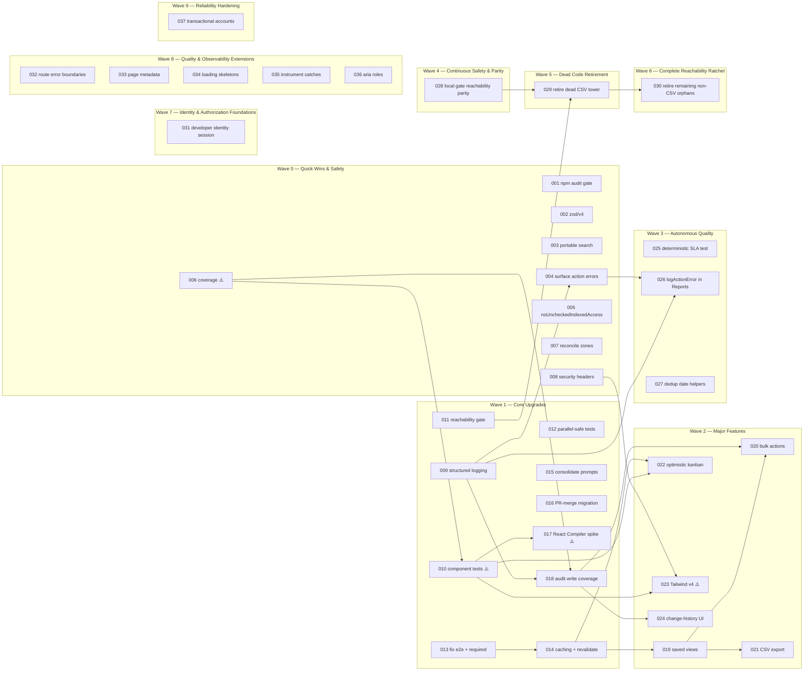

# ROADMAP — salesforce-lite-crm modernization (v2026.05)

Generated by the **Repository Discovery, Competitive Web Architecting & Blueprinting** goal.
This roadmap sequences 24 atomic specs (`plan/specs/NNN_*.md`) into three execution waves.
Every spec is self-contained: Description & Expected Impact, Definition of Done, Implementation Approach (files to touch), Test Strategy.

> **Authority:** `CLAUDE.md` and `PLAN.md` win over this document. Where a spec touches a *sacred* surface (seed, schema, `.claude/**` config) or a *non-goal*, the spec's Scope-gate says so — obey it.

---

## How to read the scores

Each spec carries four ratings:

- **Impact** (1–5) — user/business or codebase-health value delivered.
- **Feasibility** (1–5) — how tractable it is given the current code (higher = easier).
- **Risk** (Low / Med / High) — blast radius + chance of regression.
- **Codebase Fit** (1–5) — how naturally it sits on existing structures (higher = more idiomatic).

**Priority Score** (used to rank the master table) = `Impact + Feasibility + Codebase Fit + RiskBonus`, where RiskBonus = Low → +2, Med → +1, High → 0. Range 0–17. It is a *tiebreaker/global view only* — **actual execution order is by wave + dependency DAG**, not raw score.

---

## Master Prioritization Table

Ranked by Priority Score (desc). `Dep` = upstream specs that must land first. ⚠️ = requires explicit dependency/scope approval before execution.

| Rank | Spec | Title | Wave | Impact | Feas | Risk | Fit | Score | Dep | Gate |
|----:|:----|:------|:----:|:-----:|:----:|:----:|:---:|:-----:|:----|:----:|
| 1 | 001 | CI `npm audit` gate | P0 | 3 | 5 | Low | 5 | 15 | — | |
| 2 | 003 | Portable case-insensitive search | P0 | 4 | 4 | Low | 5 | 15 | — | |
| 3 | 004 | Surface server-action errors | P0 | 4 | 4 | Low | 5 | 15 | 009 | |
| 4 | 006 | Vitest coverage reporting | P0 | 3 | 5 | Low | 5 | 15 | — | ⚠️ |
| 5 | 009 | Structured logging | P1 | 4 | 4 | Low | 5 | 15 | — | |
| 6 | 002 | Zod v4 imports (`zod/v4`) | P0 | 3 | 4 | Low | 5 | 14 | — | |
| 7 | 007 | Reconcile ownership zones | P0 | 2 | 5 | Low | 5 | 14 | — | |
| 8 | 015 | Consolidate agent prompts | P1 | 3 | 4 | Low | 5 | 14 | — | |
| 9 | 005 | `noUncheckedIndexedAccess` | P0 | 4 | 3 | Med | 5 | 13 | — | |
| 10 | 011 | Reachability gate + retire CSV tower | P1 | 5 | 2 | Med | 5 | 13 | — | |
| 11 | 013 | Fix e2e + promote to required | P1 | 4 | 3 | Med | 5 | 13 | — | |
| 12 | 016 | Complete PR-merge migration | P1 | 4 | 3 | Med | 5 | 13 | — | |
| 13 | 018 | Audit-event write coverage | P1 | 3 | 3 | Low | 5 | 13 | 009, 006 | |
| 14 | 019 | Saved views + persisted filters | P2 | 5 | 3 | Med | 4 | 13 | 014 | |
| 15 | 021 | CSV export for core entities | P2 | 4 | 3 | Low | 4 | 13 | 019 | |
| 16 | 024 | Audit-trail change-history UI | P2 | 4 | 3 | Low | 4 | 13 | 018 | |
| 17 | 008 | Security headers baseline | P0 | 3 | 4 | Med | 4 | 12 | — | |
| 18 | 010 | Component unit tests | P1 | 4 | 3 | Med | 4 | 12 | 006 | ⚠️ |
| 19 | 014 | Targeted caching + revalidation | P1 | 4 | 3 | Med | 4 | 12 | 013 | |
| 20 | 020 | Bulk actions (Leads & Deals) | P2 | 4 | 3 | Med | 4 | 12 | 019, 018 | |
| 21 | 017 | React Compiler evaluation (spike) | P1 | 3 | 3 | Med | 4 | 11 | 010 | ⚠️ |
| 22 | 022 | Optimistic UI for deal kanban | P2 | 3 | 3 | Med | 4 | 11 | 014, 010 | |
| 23 | 012 | Parallel-safe tests | P1 | 3 | 2 | Med | 4 | 10 | — | |
| 24 | 023 | Tailwind v4 (Oxide) migration | P2 | 2 | 3 | Med | 3 | 9 | 008, 010 | ⚠️ |
| 25 | 025 | Deterministic Case SLA Seed Test | P3 | 4 | 5 | Low | 5 | 16 | — | |
| 26 | 029 | Retire Dead CSV Tower | P5 | 4 | 5 | Low | 5 | 16 | 011, 028 | |
| 27 | 026 | Extend logActionError in Reports | P3 | 4 | 4 | Low | 5 | 15 | 009, 004 | |
| 28 | 027 | Dedup Date UTC Helpers | P3 | 3 | 5 | Low | 5 | 15 | — | |
| 29 | 028 | Local Gate Reachability Parity | P4 | 3 | 5 | Low | 5 | 15 | — | |
| 30 | 030 | Retire Remaining Non-CSV Orphans | P6 | 3 | 5 | Low | 5 | 15 | 029 | |
| 31 | 031 | Developer Identity Session Switcher | P7 | 5 | 5 | Low | 5 | 17 | — | |
| 32 | 032 | Route Error Boundaries | P8 | 4 | 5 | Low | 5 | 16 | — | |
| 33 | 033 | Page Metadata for List & Form Routes | P8 | 3 | 5 | Low | 5 | 15 | — | |
| 34 | 034 | Loading Skeletons for Missing Routes | P8 | 3 | 5 | Low | 5 | 15 | — | |
| 35 | 035 | Instrument Silent Catch Blocks with Logger | P8 | 4 | 5 | Low | 5 | 16 | — | |
| 36 | 036 | Accessibility: ARIA Roles for Tabs and Progress Bars | P8 | 3 | 5 | Low | 5 | 15 | — | |
| 37 | 037 | Transactional Audit Logging for Accounts Actions | P9 | 4 | 5 | Low | 5 | 16 | — | |

**⚠️ Dependency/scope-gated (do not execute without explicit approval):** 006 (`@vitest/coverage-v8`), 010 (DOM test env), 017 (`babel-plugin-react-compiler`), 023 (Tailwind 4 + `@tailwindcss/postcss`). These are blueprinted but **blocked** under CLAUDE.md §14 / LOOP §11 until a human/promotion request clears the new dependency.

---

## Wave 0 — Quick Wins & Safety

Low-risk, high-leverage hardening. Mostly config/CI/type-safety with tight blast radius. **Do these first**; several are prerequisites for later waves.

**Execution order (dependency-respecting):**
1. **001** — CI `npm audit` gate (CI-only; 0 vulns baseline today — lock it in).
2. **002** — Zod v4 imports via `zod/v4` (no version bump; faster, smaller).
3. **003** — Portable, case-insensitive search (fix `lib/services/search.ts` `contains` to be provider-portable + tested).
4. **007** — Reconcile ownership zones (`.claude/zones.json`; needs `[CONFIG CHANGE]`).
5. **006** ⚠️ — Vitest coverage reporting (gated dep) — **unblocks measuring 010/018**.
6. **005** — `noUncheckedIndexedAccess` (do before big refactors so new code is written against it).
7. **008** — Security headers baseline (additive `next.config.mjs`; currently none).
8. **004** — Surface server-action errors (lands interim with `console.error`, swaps to 009's logger).

> 004 lists 009 as a dependency but may land interim — keep that ordering flexible. Everything else here is independent.

## Wave 1 — Core Upgrades

Structural improvements to logging, tests, CI gating, caching, and the audit substrate. These create the platform the Phase 2 features stand on.

**Execution order (dependency-respecting):**
1. **009** — Structured logging (enables 004's final form + 018).
2. **015** — Consolidate agent prompts (docs; coordinate with landed PR-merge docs).
3. **011** — Reachability gate + retire the dead CSV tower (ratchet test gates deletion; **021 later revives part of `lib/server` CSV as a live consumer** — sequence note).
4. **012** — Parallel-safe tests (lifts the `--maxWorkers=1` constraint; seed stays sacred).
5. **016** — Complete PR-merge migration (`enforce_admins=true` is the **last**, only-after-green step).
6. **013** — Fix e2e + promote to required (branch-protection flip is the closing step).
7. **014** — Targeted caching + revalidation (after 013 proves freshness e2e; **prereq for 019/022**).
8. **006 → 010** ⚠️ — Component unit tests (gated DOM env; needs 006 for coverage).
9. **018** — Audit-event write coverage (needs 009; verified via 006; **prereq for 020/024**).
10. **017** ⚠️ — React Compiler evaluation (spike + decision only; needs 010's safety net).

## Wave 2 — Major Features

User-facing CRM parity features. Each sits on Wave 1 plumbing (caching, audit, component tests). **Build 019 first** — it unblocks the rest.

**Execution order (dependency-respecting):**
1. **019** — Saved views + persisted per-entity filters/sort (the keystone; needs 014; confirm against PLAN.md §4).
2. **021** — CSV export for core entities (needs 019's filter context; export-only — **import-apply stays a non-goal**).
3. **024** — Audit-trail change-history UI (needs 018; **drawer/panel only — no `/deals/[id]` route**).
4. **020** — Bulk actions for Leads & Deals (needs 019 selection + 018 audit).
5. **022** — Optimistic UI for the deal kanban (needs 014 read-your-writes + 010 component tests).
6. **023** ⚠️ — Tailwind v4 migration (gated dep; standalone PR; needs 008 + 010 as a regression net).

## Wave 3 — Autonomous Quality & Robustness

Hardening, test determinism, and observability upgrades promoted from the backlog to lock in frontier quality.

**Execution order (dependency-respecting):**
1. **025** — Deterministic Case SLA Seed Test (low risk, high leverage).
2. **027** — Dedup Date UTC Helpers (pure refactoring).
3. **026** — Extend logActionError in Reports (needs 009 and 004).

## Wave 4 — Continuous Safety & Parity

Continuous improvement wave to enforce toolchain parity, environment safety, and developer workflow consistency.

**Execution order (dependency-respecting):**
1. **028** — Local Gate Reachability Parity (low risk, high leverage, independent).

## Wave 5 — Dead Code Retirement & Reachability Ratchet

Tuning, optimization, and dead code retirement to prune legacy unused packet towers and lower baseline constraints.

**Execution order (dependency-respecting):**
1. **029** — Retire Dead CSV Tower (low risk, high leverage; needs 011 and 028).

## Wave 6 — Complete Reachability Zero-Orphans Ratchet

Continuous safety wave to completely prune any remaining dead modules and enforce a strict zero allowed orphans reachability baseline.

**Execution order (dependency-respecting):**
1. **030** — Retire Remaining Non-CSV Orphans (low risk, high leverage; needs 029).

## Wave 7 — Identity & Authorization Foundations

Lightweight developer identity session switcher and multi-user mock harness to support RBAC and record ownership.

**Execution order (dependency-respecting):**
1. **031** — Developer Identity Session Switcher & Multi-user Mock Harness (low risk, high leverage).

## Wave 8 — Quality & Observability Extensions

Resilience, SEO/accessibility standardization, and observability upgrades to polish the codebase for next-frontier robustness.

**Execution order (dependency-respecting):**
1. **032** — Route Error Boundaries (low risk, independent).
2. **033** — Page Metadata for List & Form Routes (low risk, independent).
3. **034** — Loading Skeletons for Missing Routes (low risk, independent).
4. **035** — Instrument Silent Catch Blocks with Logger (low risk, independent).
5. **036** — Accessibility: ARIA Roles for Tabs and Progress Bars (low risk, independent).

## Wave 9 — Advanced Enterprise Modernization & Reliability Hardening

Data-integrity, audit compliance, and transaction safety improvements to ensure absolute resilience of core business data paths.

**Execution order (dependency-respecting):**
1. **037** — Transactional Audit Logging for Accounts Actions (low risk, independent).

---

## Dependency graph

---

## Non-goals (do not implement — permanent, per PLAN.md/CLAUDE.md §12)

Auth · deployment · external AI providers · Salesforce integration · Postgres-as-default · dealer/area CRUD · live `/deals/[id]` route · `/search` page · geocoding · persistent forecast scenarios · **CSV import-apply** beyond the bounded Sprint 40 contact-create path · background jobs.

Anything here requires a **promotion request in PLAN.md** before a spec may build it. Specs 019, 021, 023, 024 each restate the relevant non-goal in their Scope-gate.

---

## Tracking

Live status for every spec lives in **`plan/PROGRESS.md`**. Runtime rules + the exact verification gate live in **`plan/AGENTS.md`**.
